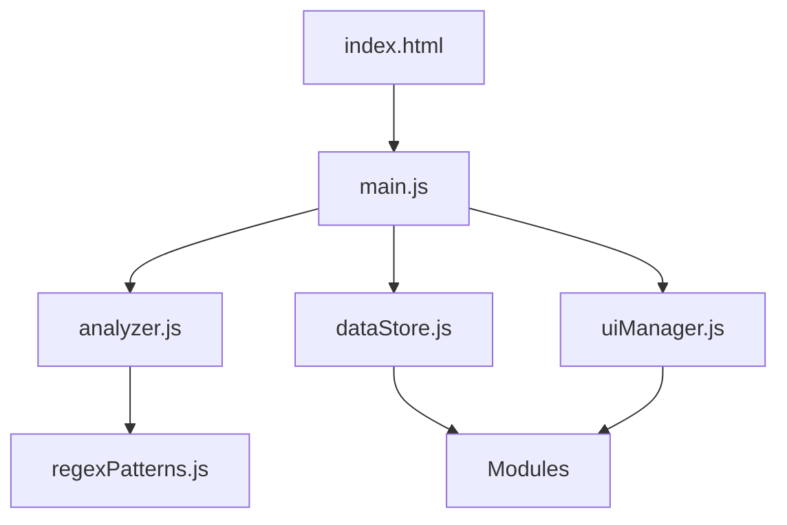

# Architecture des Modules VintedPro

## 1. Tutoriel : Ajouter un nouveau module au dashboard

### Fichiers à modifier :
1. `/src/modules/MonModule.js` (nouveau fichier)
   - Créer la classe du module
   - Définir la structure et le comportement

2. `main.js`
   - Importer le nouveau module
   - L'initialiser dans initializeModules()
   - L'ajouter au dashboard

3. `index.html`
   - Ajouter la structure HTML si nécessaire

## 2. Core Files (Fichiers Essentiels)

### src/regexPatterns.js
- Contient TOUS les patterns regex
- Définit les extracteurs de données
- Inclut les transformateurs de données
- Structure :
  ```javascript
  {
    patterns: { /* patterns regex */ },
    extractors: { /* fonctions d'extraction */ },
    transformers: { /* fonctions de transformation */ }
  }
  ```
- Utilisé par analyzer.js

### src/analyzer.js
- Contient la logique d'analyse
- Utilise les patterns de regexPatterns.js
- Structure principale de données :
  ```javascript
  {
    boutique: { /* infos boutique */ },
    marketing: { /* données marketing */ },
    finances: { /* données financières */ },
    ventes: [ /* liste des ventes */ ],
    ventes_stat: [ /* statistiques ventes */ ]
  }
  ```
- Calcule les statistiques supplémentaires

### src/dataStore.js
- Gère l'état global de l'application
- Implémente un pattern Observer
- Structure :
  ```javascript
  {
    rawText: '', // texte brut
    analyzedData: null, // données analysées
    stats: null, // statistiques
    ui: { /* état UI */ }
  }
  ```
- Fournit des méthodes pour :
  - Obtenir l'état (getState)
  - Mettre à jour l'état (setState)
  - S'abonner aux changements (subscribe)

### src/uiManager.js
- Gère l'interface utilisateur globale
- Contrôle :
  - La visibilité des sections
  - Les transitions entre états
  - L'affichage des erreurs
  - Le loader
  - La navigation par onglets

## 3. Modules (/src/modules/)

### Structure de base d'un module
```javascript
class MonModule {
    constructor() {
        this.name = 'MonModule';
        this.container = null;
    }

    initialize() {
        // Configuration initiale
    }

    update(state) {
        // Mise à jour basée sur l'état
    }

    render() {
        // Rendu du module
    }

    destroy() {
        // Nettoyage
    }
}
```

### Modules existants
- AccountModule.js - Gestion du compte
- ProfileModule.js - Profil utilisateur
- SalesStatsModule.js - Statistiques de ventes
- SidebarModule.js - Navigation latérale

## 4. Relations entre les Fichiers



## 5. Flux de Données

1. `index.html` : Entrée utilisateur
2. `main.js` : Coordination
3. `analyzer.js` : Analyse (avec regexPatterns.js)
4. `dataStore.js` : Stockage des résultats
5. Modules : Mise à jour de l'affichage
6. `uiManager.js` : Gestion de l'interface
